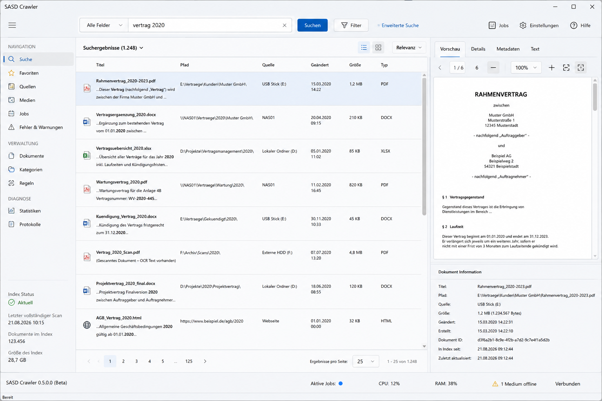

# SASD Crawler

Native Windows desktop crawler and full-text search application for local folders, USB/offline media, SMB shares and websites.

> **Project status:** planning / architecture validation. The product architecture and requirements are extensively specified; production implementation is intentionally not treated as complete until the PoC and quality gates in the roadmap are passed.

## UI concept

The following screenshot is a **design concept**, not a screenshot of an already implemented build.



The intended desktop experience is search-first: a native Windows Forms application with a central query field, result list, filters, source/media status and a safe preview pane.

## Product idea

SASD Crawler should make information searchable **without forcing users to move documents into a new document-management repository**.

Planned source types include:

- local folders and drives,
- removable USB media and external disks,
- SMB/UNC network shares,
- websites and linked documents.

The crawler is intended to index the contents of relevant document formats, including Office files and PDF, with OCR for scanned documents.

A key product goal is **offline media awareness**: an indexed document should remain discoverable even while its USB disk is disconnected. The result should identify the missing medium and known relative path rather than silently disappearing.

## Target architecture

Current architecture baseline:

```text
Windows Forms / .NET 8
        │
        ▼
Application + Domain
        │
 ┌──────┼───────────────┐
 ▼      ▼               ▼
SQLite  Lucene.NET      Source layer
Control Search          File / USB / SMB / Web
 Store   │               │
 └───────┼───────────────┘
         ▼
  Durable Work Queue
         │
   ┌─────┴─────┐
   ▼           ▼
Apache Tika  Tesseract
  Sidecar       OCR
```

Architectural principles:

- WinForms is the **presentation layer**, not the crawler implementation.
- Domain and application logic remain UI-independent.
- SQLite is the durable control/metadata store.
- Lucene.NET is the preferred v1 embedded search backend behind an abstraction and must pass a dedicated PoC.
- Apache Tika is the reference document parser, isolated from the UI process.
- Tesseract provides local OCR.
- File-system watchers are hints only; full reconciliation decides removals.
- removable media use a stable internal `MediaId` plus relative paths.
- the default v1 security model is per-Windows-user, with data under the user's profile.

## Current phase

The immediate work is **Milestone 0.0.x – architecture feasibility**:

1. WinForms + Generic Host lifecycle spike.
2. Lucene.NET performance/recovery spike.
3. Apache Tika sidecar/packaging spike.
4. Windows removable-media identity spike.
5. Tika vs. Toxy parser benchmark.
6. G0 architecture feasibility decision.

Only after G0 should Milestone 0.1 begin.

See [`ROADMAP.md`](ROADMAP.md) for the detailed status and gates.

## Documentation

Start here:

| Document | Purpose |
|---|---|
| [`docs/baseline/LASTENHEFT.md`](docs/baseline/LASTENHEFT.md) | functional/product requirements |
| [`docs/baseline/PFLICHTENHEFT.md`](docs/baseline/PFLICHTENHEFT.md) | technical requirements for the WinForms/.NET 8 baseline |
| [`docs/baseline/ARCHITECTURE.md`](docs/baseline/ARCHITECTURE.md) | detailed software architecture |
| [`ROADMAP.md`](ROADMAP.md) | milestones, gates, dependencies and current progress |
| [`PROJECT-STATUS.md`](PROJECT-STATUS.md) | concise current project snapshot |
| [`REQUIREMENTS-STATUS.md`](REQUIREMENTS-STATUS.md) | implementation/verification status for all requirement IDs |
| [`docs/planning/POC-PLAN.md`](docs/planning/POC-PLAN.md) | mandatory architecture spikes |
| [`docs/testing/QUALITY-GATES.md`](docs/testing/QUALITY-GATES.md) | release and milestone acceptance gates |
| [`docs/security/SECURITY-PLAN.md`](docs/security/SECURITY-PLAN.md) | security boundaries and controls |
| [`AGENTS.md`](AGENTS.md) | instructions for autonomous coding agents |
| [`RULES.md`](RULES.md) | command and safety rules for Codex |

The documentation baseline and conflict-resolution rules are defined in [`BASELINE-AND-CHANGE-CONTROL.md`](BASELINE-AND-CHANGE-CONTROL.md).

## Requirements status

The project currently separates three states:

```text
specified ≠ implemented ≠ verified
```

The requirements register must never mark work as complete simply because it has been documented.

## Development approach

Development should proceed in **vertical, testable slices**.

The first real slice after the architecture PoCs is intentionally small:

```text
Local folder
  → discover TXT/HTML
  → persistent document registry
  → Lucene index
  → WinForms search
  → snippet
  → open original
  → update/delete reconciliation
```

Office/PDF, USB, SMB, web crawling and OCR are added only after the preceding gates are stable.

## Repository automation

Codex may work autonomously on routine repository-local development. The project explicitly permits safe PowerShell, `dotnet`, Git and selected GitHub CLI operations without requesting confirmation each time.

See:

- [`AGENTS.md`](AGENTS.md)
- [`RULES.md`](RULES.md)
- [`.codex/rules/default.rules`](.codex/rules/default.rules)
- [`docs/codex/PROMPT-0.0.1-AUTONOMOUS.md`](docs/codex/PROMPT-0.0.1-AUTONOMOUS.md)
- [`docs/codex/FIRST-TASK-0.0.1.md`](docs/codex/FIRST-TASK-0.0.1.md)

Destructive filesystem/system commands, force-pushes, repository deletion, secret changes and privilege elevation are not permitted autonomously.

## License

No project license has been selected in this starter package. Add a `LICENSE` only after the intended licensing model has been explicitly decided.
