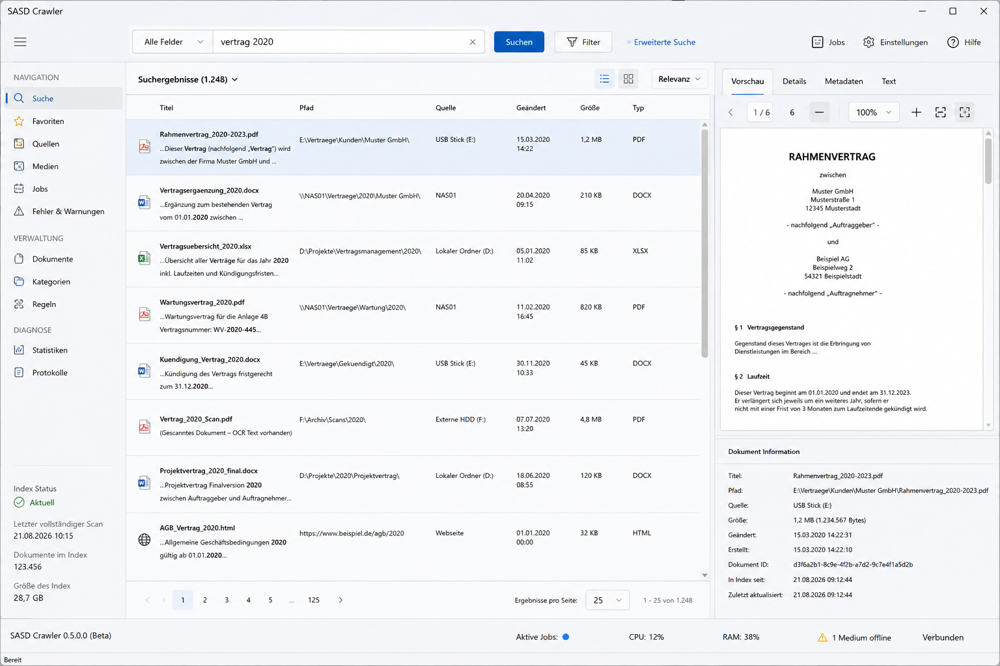

# SASD Crawler

Native Windows desktop crawler and full-text search application for local folders, USB/offline media, SMB/UNC shares and websites.

> **Current status (6 October 2026):** architecture validation. Milestone **0.0.1 / A1** is merged on `main` with **CONDITIONAL GO** (build clean, 9/9 automated tests, manual interactive desktop smoke evidence still pending). **0.0.2 / A2 – Lucene.NET** is the next active spike.

## UI concept

The following image is a **design concept**, not a screenshot of the implemented A1 spike.



The intended desktop experience is search-first: a native Windows Forms application with a central query field, result list, filters, source/media status and a safe preview pane.

## Product idea

SASD Crawler makes information searchable **without forcing users to move documents into a document-management repository**.

Planned source types include:

- local folders and drives,
- removable USB media and external disks,
- SMB/UNC network shares,
- websites and linked documents.

The crawler is intended to index relevant document contents, including Office files and PDF, with OCR for scanned documents.

A key product goal is **offline media awareness**: an indexed document remains discoverable while its USB disk is disconnected. Results identify the missing medium and known relative path rather than silently disappearing.

## Architecture baseline

```text
Windows Forms / .NET 8
        │
        ▼
Application + Domain
        │
 ┌──────┼───────────────┐
 ▼      ▼               ▼
SQLite  Lucene.NET      Source layer
Control Search          File / USB / SMB / Web
 Store   │               │
 └───────┼───────────────┘
         ▼
  Durable Work Queue
         │
   ┌─────┴─────┐
   ▼           ▼
Apache Tika  Tesseract
  Sidecar       OCR
```

Core principles:

- WinForms is the **presentation layer**, not the crawler implementation.
- Domain/application logic remain UI-independent.
- SQLite is the durable control/metadata store.
- Lucene.NET is the preferred embedded v1 search backend behind `ISearchIndex`; A2 must prove it.
- Apache Tika is the reference parser family, isolated from the UI process; A3 must choose the concrete supported line/package strategy.
- Tesseract is the planned local OCR engine.
- File-system watchers are hints only; successful full reconciliation decides source-wide removals.
- removable media use a stable internal `MediaId` plus relative paths.
- the default v1 security model is per-Windows-user, with data under the user's profile.

## Verified implementation so far

A1 has established a real .NET 8 WinForms spike with:

- Generic Host and DI,
- cancellable `BackgroundService`,
- SQLite heartbeat persistence in `%LOCALAPPDATA%`,
- MVP/presenter boundary and UI-thread marshalling,
- tray commands (Open, Pause/Resume, Exit),
- per-user single-instance mutex plus named-pipe activation,
- 9/9 automated tests.

Evidence: [`docs/evidence/0.0.1/SUMMARY.md`](docs/evidence/0.0.1/SUMMARY.md).

A1 remains **CONDITIONAL GO** until the manual interactive Windows smokes for tray behavior, visible responsiveness, second-launch focus and forced-kill/restart are recorded.

## Current work: A2 Lucene.NET

The next spike validates Lucene.NET 4.8.0-beta00018 on .NET 8 with 100k/1M-document workloads, updates/deletes, NRT search, German/English analyzers, phrase/Boolean/fuzzy/prefix queries, highlighting, facets, concurrent readers, coordinated writing and crash/reopen recovery.

See:

- [`docs/codex/FIRST-TASK-0.0.2.md`](docs/codex/FIRST-TASK-0.0.2.md)
- [`docs/codex/PROMPT-0.0.2-AUTONOMOUS.md`](docs/codex/PROMPT-0.0.2-AUTONOMOUS.md)

## Technology watch

The project intentionally separates **chosen product architecture** from **current dependency versions**.

- .NET 8 remains the requested development target, but reaches Microsoft end of support on **10 November 2026**. The repository pins the current .NET 8 servicing SDK and the migration decision must be revisited at G0/before production release.
- Lucene.NET 4.8.0-beta00018 remains the current 4.8 beta line and explicitly supports .NET 8; A2 exists because its formal status is still Beta.
- Apache Tika 4.1.0 is now current, while 3.3.2 remains a supported maintenance line. A3 will compare the packaging/migration/security trade-offs rather than assuming the older line forever.
- Tesseract 5.5.3 remains the current release line for the planned OCR PoC.

## Roadmap

```text
0.0.1  A1 WinForms host lifecycle     CONDITIONAL GO
0.0.2  A2 Lucene.NET                  READY / next
0.0.3  A3 Tika sidecar/packaging      NOT STARTED
0.0.4  A4 Windows media identity      NOT STARTED
0.0.5  A5 Tika vs. Toxy               NOT STARTED
        G0 Architecture Feasibility
0.1.0   Local vertical slice
0.2.0   USB/offline + SMB
0.3.0   Web crawler
0.4.0   Office/PDF/archive
0.5.0   OCR + core search = MVP
...
1.0.0   Stable
```

The authoritative details and gates are in [`ROADMAP.md`](ROADMAP.md).

## Documentation

| Document | Purpose |
|---|---|
| [`docs/baseline/LASTENHEFT.md`](docs/baseline/LASTENHEFT.md) | functional/product requirements |
| [`docs/baseline/LASTENHEFT-AMENDMENT-0.1a.md`](docs/baseline/LASTENHEFT-AMENDMENT-0.1a.md) | accepted desktop amendment |
| [`docs/baseline/PFLICHTENHEFT.md`](docs/baseline/PFLICHTENHEFT.md) | active WinForms/.NET 8 technical baseline |
| [`docs/baseline/ARCHITECTURE.md`](docs/baseline/ARCHITECTURE.md) | detailed architecture |
| [`ROADMAP.md`](ROADMAP.md) | milestones, gates and progress |
| [`PROJECT-STATUS.md`](PROJECT-STATUS.md) | concise current snapshot |
| [`REQUIREMENTS-STATUS.md`](REQUIREMENTS-STATUS.md) | status of all requirement IDs |
| [`docs/QUALITY-LEVEL.md`](docs/QUALITY-LEVEL.md) | quality maturity model and current level |
| [`docs/planning/POC-PLAN.md`](docs/planning/POC-PLAN.md) | architecture spikes |
| [`docs/testing/QUALITY-GATES.md`](docs/testing/QUALITY-GATES.md) | release/milestone gates |
| [`docs/security/SECURITY-PLAN.md`](docs/security/SECURITY-PLAN.md) | security boundaries |
| [`docs/audits/REPOSITORY-RECONCILIATION-2026-10-06.md`](docs/audits/REPOSITORY-RECONCILIATION-2026-10-06.md) | current repository/chat/code reconciliation |
| [`AGENTS.md`](AGENTS.md) | autonomous agent instructions |
| [`RULES.md`](RULES.md) | command/safety policy |

`specified ≠ implemented ≠ verified ≠ released` remains a project invariant.

## Continuous integration

The Windows CI workflow restores, verifies formatting, builds and runs tests on pull requests and pushes to `main`. CI does not replace manual hardware/desktop evidence where the gate explicitly requires it.

## License

Licensed under the [MIT License](LICENSE).
